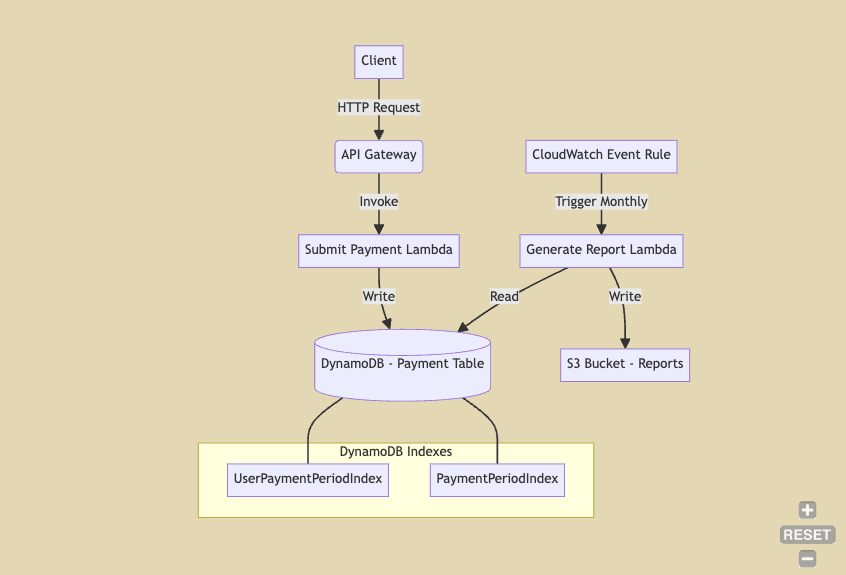

# Bits Assignment



## Project Structure

The project follows a typical CDK TypeScript setup:

- **bin/**: Contains the entry point of the CDK application.
- **lib/**: Contains the stack definition.
- **src/**: Contains the lambda and helpers.
- **test/**: Contains the unit tests for the stack.

## Prerequisites

Ensure you have the following installed:

- Node.js (>= 22.x)
- AWS CLI (configured with your credentials)
- AWS CDK Toolkit (installed globally via `npm install -g aws-cdk`)

## Useful Commands

- `npm run build`: Compile TypeScript to JavaScript.
- `npm run test`: Run Jest unit tests.
- `npx cdk deploy`: Deploy this stack to your default AWS account/region.
- `npx cdk diff`: Compare deployed stack with the current state.

## Getting Started

1. **Install dependencies**:
    ```sh
    npm install
    ```

2. **Run tests**:
    ```sh
    npm run test
    ```

3. **Deploy the stack**:
    ```sh
    npx cdk deploy
    ```

## Project Configuration

The `cdk.json` file tells the CDK Toolkit how to execute your app.

## Data Model
The DynamoDB table has the following structure:

- paymentId (Partition Key): String
- userId: String
- paymentDate: String
- paymentYearMonth: String
- description: String
- currency: String
- amount: Number

## Global Secondary Indexes:

1. UserPaymentPeriodIndex:

    Partition Key: userId
    Sort Key: paymentYearMonth


2. PaymentPeriodIndex:

    Partition Key: paymentYearMonth

## Environment Variables

- TABLE_NAME: Name of the doc table
- BUCKET_NAME: Name of the S3 bucket for storing reports
- USER_PAYMENT_PERIOD_INDEX_NAME: Name of the index in which userId and payment period both can be used to query
- PAYMENT_PERIOD_INDEX_NAME: For querying by payment period

